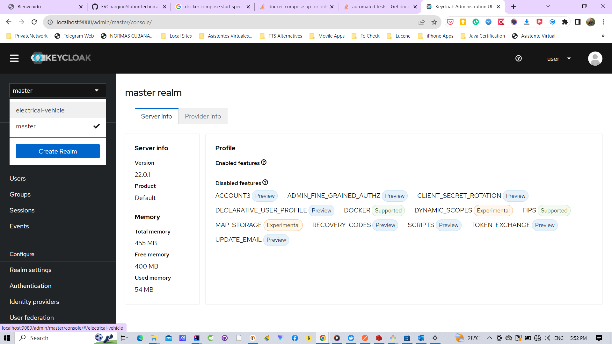
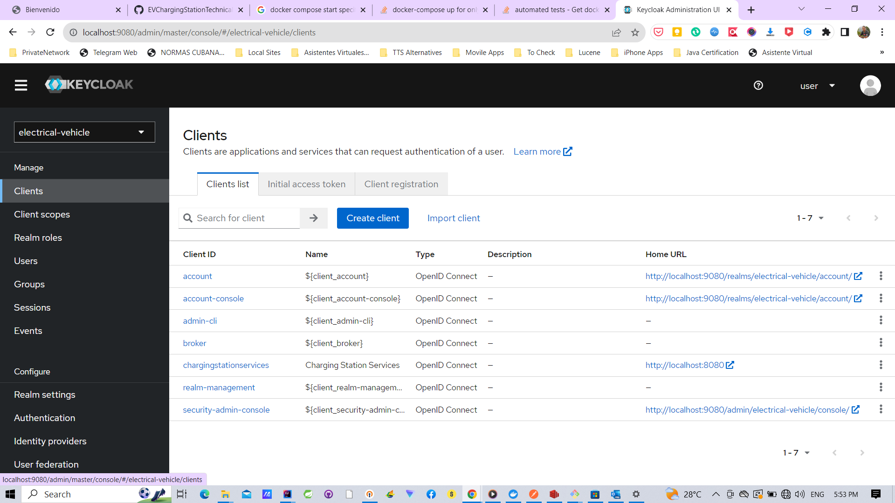
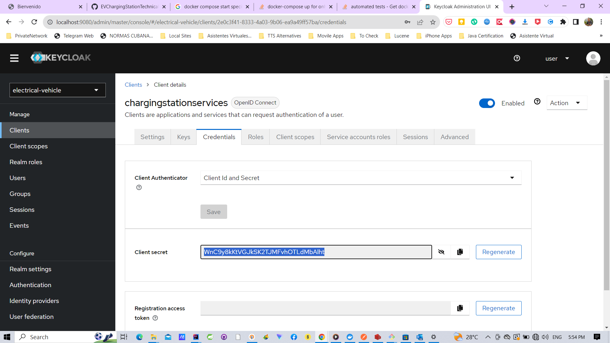
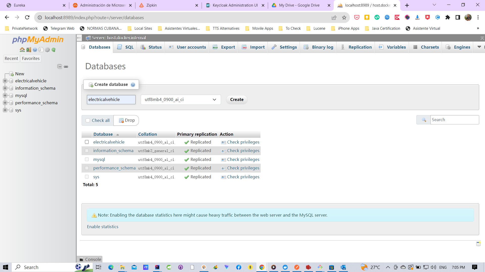

#Electrical Vehicle miroservices architecture

### Configure keycloak
1. Download from Drive https://drive.google.com/file/d/1xgvuy10va4pICUljUjiq2POjDuj5T4G6/view?usp=drive_link
2. Modify postgres volume "- C:/Users/Carlos/Desktop/microservices-base_postgresql_data/bitnami/postgresql2:/bitnami/postgresql" for "- downloaded_volume:/bitnami/postgresql"
3. docker-compose up postgresql keycloak
4. Authenticate [user:bitnami] in http://localhost:9080/admin
5. Check realm electrical-vehicle 
6. Check client chargingstationservices 
7. Chech client_secret WnC9y8kKtVGJkSK2TJMFvhOTLdMbAlht '
8. If all OK stop containers

### Create docker chargingstation
1. Go to project electrical-vehicle [branch origin/stable-rc]
2. mvn clean compile install
3. docker build . -t ev/chargingstation -f .\src\main\docker\Dockerfile

### Create DB electricalvehicle
1. Login in http://localhost:8989/ [root:password]
2. Create DB electricalvehicle 

### Run all containers
1. docker-compose up

### Testing
1. Import in postman Electrical Vehicle.postman_collection.json

### Key URIs
1. http://127.0.0.1:8761/ [Discovery/Registry server]
2. http://127.0.0.1:8095/ [Administration Server]
3. http://127.0.0.1:9411/ [Tracing Server]
4. http://localhost:8989/ [MySQL UI]
5. http://localhost:9080/ [Identity Server]

